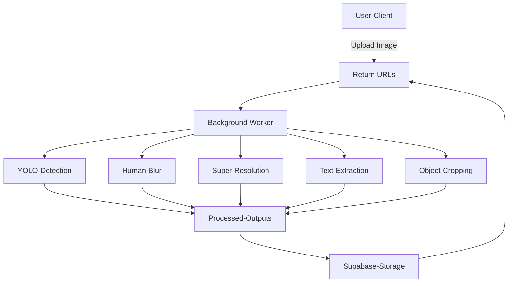
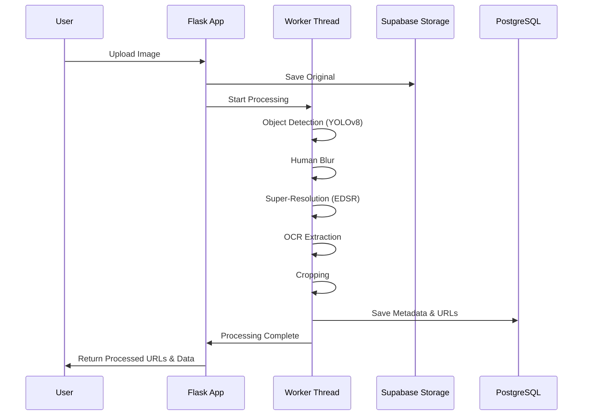

# Image Processing and Enhancement Platform

A comprehensive Flask-based web application for advanced image processing, including object detection, privacy protection (human blurring), super-resolution enhancement, and text extraction. Supports both a web interface and a RESTful API.

## Table of Contents

1. [Overview](#overview)  
2. [Key Features](#key-features)  
3. [Technology Stack](#technology-stack)  
4. [Architecture Diagram](#architecture-diagram)  
5. [Security Implementation](#security-implementation)  
6. [Workflow Architecture](#workflow-architecture)  
7. [Database Schema](#database-schema)  
8. [Installation and Setup](#installation-and-setup)  
9. [API Documentation](#api-documentation)   
10. [Performance Considerations](#performance-considerations)  
11. [Deployment Guidelines](#deployment-guidelines)  
12. [Usage Examples](#usage-examples)  
13. [Troubleshooting](#troubleshooting)  


## Overview

This platform enables real-time and batch image processing with:

- YOLOv8 object detection (80+ classes)  
- Human subject blurring for privacy  
- 4x Super-Resolution using EDSR  
- Multi-language OCR (EasyOCR)  
- Asynchronous background processing  
- Supabase cloud storage & metadata management  

Additional features:

- Responsive gallery to view processed images  
- Analytics tracking for views, downloads, and text copy counts  

## Key Features

| Feature | Details |
|---------|---------|
| Object Detection | YOLOv8 detection, bounding boxes, confidence scores |
| Privacy Protection | Automatic blur on human subjects |
| Super-Resolution | 4x enhancement using EDSR models |
| Text Extraction | Multi-language OCR with EasyOCR |
| Background Processing | Separate threads for detection, OCR, SR |
| Cloud Storage | Supabase Storage with signed URLs |
| RESTful API | Upload, check status, retrieve results |
| Gallery | Browse images, view detections, download |
| Analytics | Track views, downloads, text copy counts |

## Technology Stack

| Layer | Tools |
|-------|------|
| Backend | Flask, OpenCV, YOLOv8, EasyOCR, EDSR, Supabase |
| Frontend | HTML5/CSS3, JavaScript, Jinja2 |
| Infrastructure | Supabase Storage, PostgreSQL, Threading |

## Architecture Diagram



## Security Implementation

- **Data Protection:** Human blur, input validation, file type checks  
- **Application Security:** Secret management, SQL injection protection, XSS & CSRF protection  
- **Storage Security:** Supabase RLS, signed URLs, UUID filenames  

## Workflow Architecture



## Database Schema

```sql
CREATE TABLE image_records (
  id SERIAL PRIMARY KEY,
  original_url TEXT NOT NULL,
  processed_url TEXT,
  status VARCHAR(20) DEFAULT 'pending',
  sr_completed BOOLEAN DEFAULT FALSE,
  yolo_completed BOOLEAN DEFAULT FALSE,
  ocr_completed BOOLEAN DEFAULT FALSE,
  cropping_completed BOOLEAN DEFAULT FALSE,
  db_completed BOOLEAN DEFAULT FALSE,
  detections_count INTEGER DEFAULT 0,
  text_elements_count INTEGER DEFAULT 0,
  cropped_objects_count INTEGER DEFAULT 0,
  view_count INTEGER DEFAULT 0,
  download_count INTEGER DEFAULT 0,
  text_copy_count INTEGER DEFAULT 0,
  detections JSONB DEFAULT '[]',
  text_data JSONB DEFAULT '[]',
  cropped_objects_urls JSONB DEFAULT '[]',
  created_at TIMESTAMP DEFAULT NOW()
);
```

## Installation and Setup

**Prerequisites:** Python 3.8+, Supabase account, pip

**Environment Configuration (.env):**

```env
SECRET_KEY=your-secret-key
SUPABASE_URL=your-project-url
SUPABASE_KEY=your-anon-key
SUPABASE_BUCKET_NAME=processed-images
DEBUG=False
HOST=0.0.0.0
PORT=5000
```

### Installation Steps

```bash
# Clone the repository
git clone https://github.com/your-repo/image-processing-platform.git
cd image-processing-platform

# Create virtual environment
python -m venv venv

# Activate environment
# Unix
source venv/bin/activate
# Windows
venv\Scripts\activate

# Install dependencies
pip install -r requirements.txt

# Initialize database with provided schema

# Run the application
python app.py
```

### Required Dependencies

- Flask  
- OpenCV (opencv-python)  
- Ultralytics (YOLOv8)  
- EasyOCR  
- supabase-py  
- python-dotenv  
- NumPy  
- Pillow  

## API Documentation

### 1. Process Image

- **Endpoint:** `/api/process` (POST)  
- **Parameters:** `file` (image file), `include_images` (boolean, optional)  

## Performance Considerations

- Lazy loading of models  
- Threaded background processing  
- Efficient memory usage (encoding/decoding)  
- Database connection pooling  
- Horizontal scaling with CDN & Redis  

## Deployment Guidelines

**Production Checklist:**

- DEBUG=False  
- Secret management via .env  
- Supabase RLS  
- Logging & monitoring  
- SSL/TLS  
- Database backups  
- Rate limiting API endpoints  

## Usage Examples

**Web Interface:**

- Upload image  
- Track processing progress  
- Explore results (detections, SR, OCR)  
- Download enhanced images  

## Troubleshooting

| Issue                  | Solution                           |
|------------------------|-----------------------------------|
| Model loading errors   | Verify model path and weights     |
| Memory issues          | Reduce image size / increase RAM  |
| Supabase connection    | Check credentials and network     |
| Processing timeouts    | Use background queue/workers      |
| Debug logs             | Set DEBUG=True in .env            |
